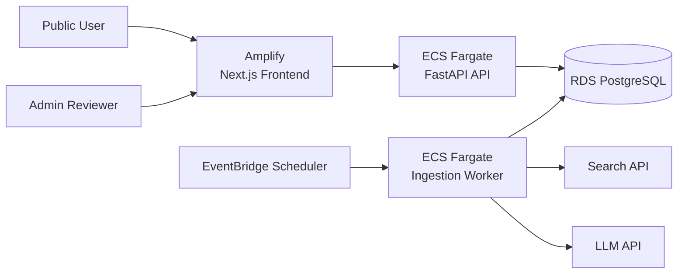

# AWS Architecture

This document describes how Coastal Watch is deployed in AWS and why specific services were chosen.

---

## Deployment Overview

The system uses managed AWS services to minimize operational overhead, support scalability, and simplify deployment.

---

## Architecture Diagram

---

## Components

- Frontend → AWS Amplify
- API → ECS Fargate
- Worker → ECS Fargate
- Database → Amazon RDS (PostgreSQL)
- Scheduler → EventBridge
- External APIs → Search + LLM services

---

## How it works

- Users access the frontend through Amplify
- The frontend communicates with the API hosted on ECS Fargate
- The API reads and writes data to RDS
- EventBridge triggers the ingestion worker every 24 hours
- The worker processes new data and updates the system

---

## Key Decisions

- Fargate → no server management and easy scaling
- Amplify → simple and fast frontend deployment
- RDS → reliable relational database for structured data
- EventBridge → native scheduling without managing cron servers