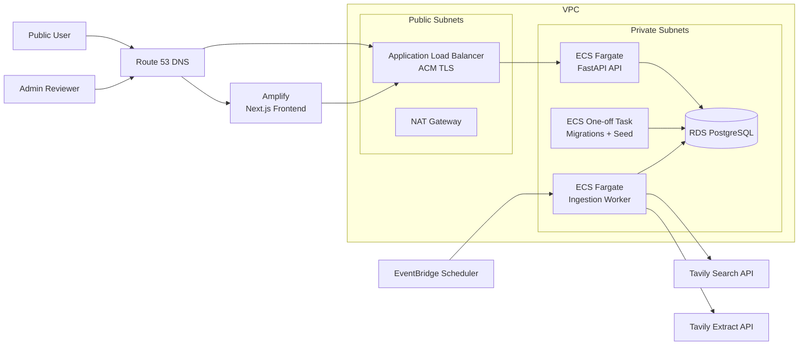

# AWS Architecture

This document describes how Coastal Watch will be deployed in AWS and why specific services were chosen.

---

## Deployment Overview

The system uses managed AWS services to minimize operational overhead, support scalability, and simplify deployment.

---

## Architecture Diagram

```mermaid
flowchart LR
    User[Public User] --> Route53[Route 53 DNS]
    Admin[Admin Reviewer] --> Route53

    Route53 --> Amplify[Amplify<br/>Next.js Frontend]
    Route53 --> ALB[Application Load Balancer<br/>ACM TLS]

    subgraph VPC["VPC"]
        direction LR

        subgraph Public["Public Subnets"]
            ALB
            NAT[NAT Gateway]
        end

        subgraph Private["Private Subnets"]
            API[ECS Fargate<br/>FastAPI API]
            Worker[ECS Fargate<br/>Ingestion Worker]
            Init[ECS One-off Task<br/>Migrations + Seed]
            RDS[(RDS PostgreSQL)]
        end
    end

    Amplify --> ALB
    ALB --> API
    API --> RDS
    Init --> RDS

    EventBridge[EventBridge Scheduler] --> Worker
    Worker --> Search[Tavily Search API]
    Worker --> Extract[Tavily Extract API]
    Worker --> RDS
```

---

## Components

- Frontend → AWS Amplify
- DNS → Route 53
- TLS → AWS Certificate Manager (ACM)
- Public ingress → Application Load Balancer (ALB)
- API → ECS Fargate
- Worker → ECS Fargate
- One-off init task → ECS Fargate task using the same backend image
- Database → Amazon RDS (PostgreSQL)
- Scheduler → EventBridge
- Networking → VPC with public and private subnets
- External APIs → Tavily Search + Tavily Extract

---

## Network Layer

Best fit for this project:

- One VPC in the deployment region
- At least two public subnets across different Availability Zones
- At least two private subnets across different Availability Zones
- Internet-facing ALB in public subnets
- ECS API tasks in private subnets
- RDS PostgreSQL in private subnets
- NAT gateway for private-task outbound access when needed

The intended traffic pattern is:

- Public users reach the frontend through Amplify
- API requests go to the ALB over HTTPS
- The ALB forwards traffic to ECS API tasks on port `8000`
- ECS API tasks connect privately to RDS on port `5432`
- The worker, when enabled, runs privately and reaches Tavily through outbound internet access

Recommended security-group boundaries:

- `cw-api-alb-sg`
  - inbound `80` / `443` from the internet
  - outbound to the API task security group
- `cw-api-task-sg`
  - inbound `8000` from `cw-api-alb-sg`
  - outbound to RDS and required AWS service endpoints
- `cw-db-sg`
  - inbound `5432` from `cw-api-task-sg`

RDS should not be publicly accessible.

---

## How it works

- Users access the frontend through Amplify and the public domain managed in Route 53
- API traffic enters through an internet-facing ALB with ACM-managed TLS
- The ALB forwards requests to the API service running on ECS Fargate
- The API reads and writes data to RDS over private networking
- EventBridge triggers the ingestion worker every 24 hours when automation is enabled
- The worker discovers reporting, extracts article content, and either auto-publishes trusted records or queues them for review

For the current manual-operations deployment phase:

- The worker and EventBridge can be omitted temporarily
- The API should run as a plain ECS service behind the ALB
- Database migrations and municipality seed should run as a one-off init task, not on every API container start
- The network layout still remains the same: ALB public, API private, RDS private

---

## Key Decisions

- Fargate → no server management and easy scaling
- Amplify → simple and fast frontend deployment
- ALB + ACM → clean HTTPS ingress for the API
- Route 53 → managed DNS for the public app and API domains
- VPC subnet split → keeps the database and API off the public internet
- RDS → reliable relational database for structured data
- EventBridge → native scheduling without managing cron servers
