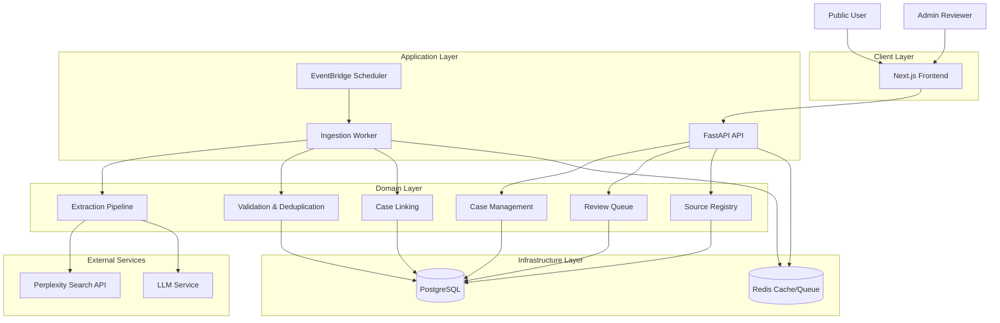

# Components Architecture

This document describes how the Coastal Watch system is structured across logical layers and how different parts of the system interact.

---

## What this diagram shows

The system is divided into layers that separate concerns between user interaction, application logic, domain logic, infrastructure, and external services.

---

## Components Diagram

---

## Architecture Layers

### Client Layer
- Next.js Frontend
- Public User
- Admin Reviewer

Handles all user interaction including map rendering, navigation, and admin review UI.

---

### Application Layer
- FastAPI API
- Ingestion Worker
- EventBridge Scheduler

Coordinates system behavior:
- API handles requests and responses
- Worker processes ingestion and AI extraction
- Scheduler triggers background jobs

---

### Domain Layer
- Case Management
- Review Queue
- Extraction Pipeline
- Case Linking
- Validation and Deduplication
- Source Registry

Contains the core business logic:
- Defines how cases are created and updated
- Controls review workflows
- Ensures data quality and consistency

---

### Infrastructure Layer
- PostgreSQL
- Redis (future use)

Responsible for data storage and system performance:
- PostgreSQL stores all structured data
- Redis supports caching or background queues

---

### External Services
- Perplexity Search API
- LLM API for Extraction

Provides external capabilities:
- Search API finds relevant articles
- LLM extracts structured data from text

---

## Key Interactions

- Users interact only with the frontend
- Frontend communicates with the API
- API reads and writes to domain services and database
- Worker handles ingestion and AI processing separately from user requests
- External APIs are used only by the worker