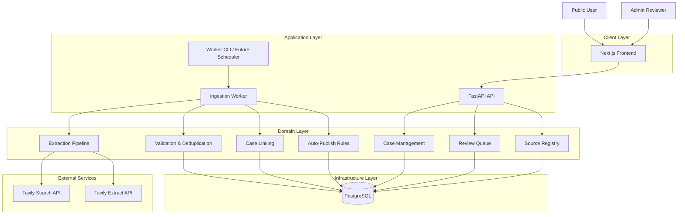

# Components Architecture

This document describes how the Coastal Watch system is structured across logical layers and how different parts of the system interact.

---

## What this diagram shows

The system is divided into layers that separate concerns between user interaction, application logic, domain logic, infrastructure, and external services.

---

## Components Diagram

```mermaid
flowchart TB
    actor1[Public User]
    actor2[Admin Reviewer]

    subgraph Client["Client Layer"]
        FE[Next.js Frontend]
    end

    subgraph App["Application Layer"]
        API[FastAPI API]
        Worker[Ingestion Worker]
        CLI[Worker CLI / Future Scheduler]
    end

    subgraph Domain["Domain Layer"]
        Cases[Case Management]
        Reviews[Review Queue]
        Sources[Source Registry]
        Extraction[Extraction Pipeline]
        Linking[Case Linking]
        Validation[Validation & Deduplication]
        Publish[Auto-Publish Rules]
    end

    subgraph Data["Infrastructure Layer"]
        PG[(PostgreSQL)]
    end

    subgraph External["External Services"]
        Search[Tavily Search API]
        Extract[Tavily Extract API]
    end

    actor1 --> FE
    actor2 --> FE

    FE --> API

    API --> Cases
    API --> Reviews
    API --> Sources

    Cases --> PG
    Reviews --> PG
    Sources --> PG

    CLI --> Worker
    Worker --> Extraction
    Worker --> Validation
    Worker --> Linking
    Worker --> Publish

    Extraction --> Search
    Extraction --> Extract
    Validation --> PG
    Linking --> PG
    Publish --> PG
```

---

## Architecture Layers

### Client Layer
- Next.js Frontend
- Public User
- Admin Reviewer

Handles all user interaction including map rendering, navigation, and admin review UI.

---

### Application Layer
- FastAPI API
- Ingestion Worker
- Worker CLI / future scheduler

Coordinates system behavior:
- API handles requests and responses
- Worker processes discovery, content extraction, routing, and publication
- CLI runs jobs manually today and can later be scheduled in infrastructure

---

### Domain Layer
- Case Management
- Review Queue
- Extraction Pipeline
- Case Linking
- Validation and Deduplication
- Source Registry
- Auto-Publish Rules

Contains the core business logic:
- Defines how cases are created and updated
- Controls review workflows
- Controls which trusted articles can publish automatically
- Ensures data quality and consistency

---

### Infrastructure Layer
- PostgreSQL

Responsible for data storage and system performance:
- PostgreSQL stores all structured data

---

### External Services
- Tavily Search API
- Tavily Extract API

Provides external capabilities:
- Search API finds relevant articles
- Extract API retrieves article content from discovered URLs

---

## Key Interactions

- Users interact only with the frontend
- Frontend communicates with the API
- API reads and writes to domain services and database
- Worker handles ingestion and publication routing separately from user requests
- External APIs are used only by the worker
