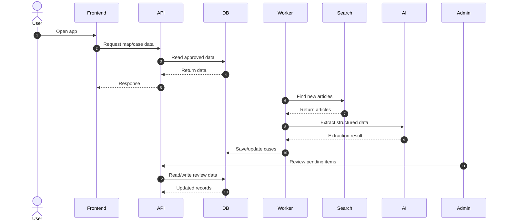

# System Overview

Coastal Watch is a civic intelligence platform that monitors coastal access and development in Puerto Rico.

## What this system does

The platform collects information from public sources, extracts structured data using AI, and routes uncertain or sensitive information through a human review process before publishing it to users.

---

## System Flow

---

## How the system works

1. User opens the app and requests map data
2. Frontend calls the API
3. API returns only approved cases from the database
4. Worker runs every 24 hours to ingest new data
5. Articles are fetched and cleaned
6. AI extracts structured data
7. Data is validated and stored
8. Uncertain data goes to the review queue
9. Admin reviews and approves or rejects items
10. Approved data becomes public

---

## Key Principles

- Source-backed data only
- Human review before publication
- Strict separation of public vs internal data
- Full auditability