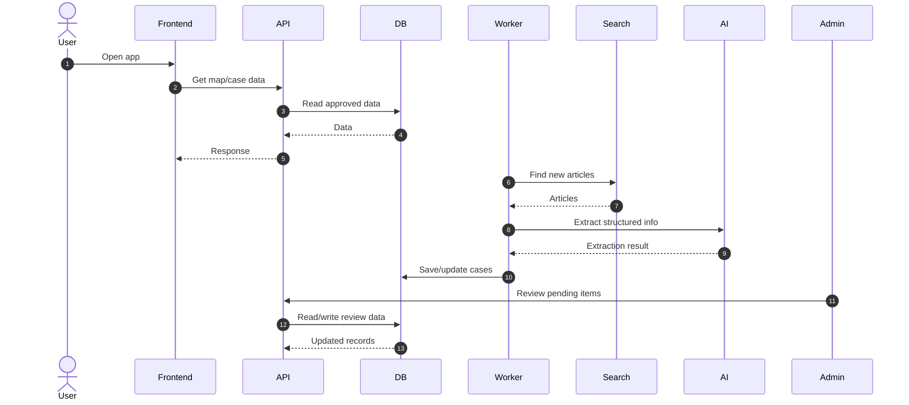

# System Overview
Coastal Watch is a civic intelligence platform that monitors coastal access and development in Puerto Rico.

## How the system works
1. User opens the app and requests map data
2. Frontend calls the API
3. API returns only approved cases from database
4. Worker runs every 24 hours to ingest new data
5. Articles are fetched and cleaned
6. AI extracts structured data
7. Data is validated and stored
8. Unceratin data goes to review queue
9. Admin reviews and approves/rejects
10. Approved data becomes public

## Key Principles
- Source-backed data only
- Human review before publication
- Strict separation of public vs internal data
- Full auditability

