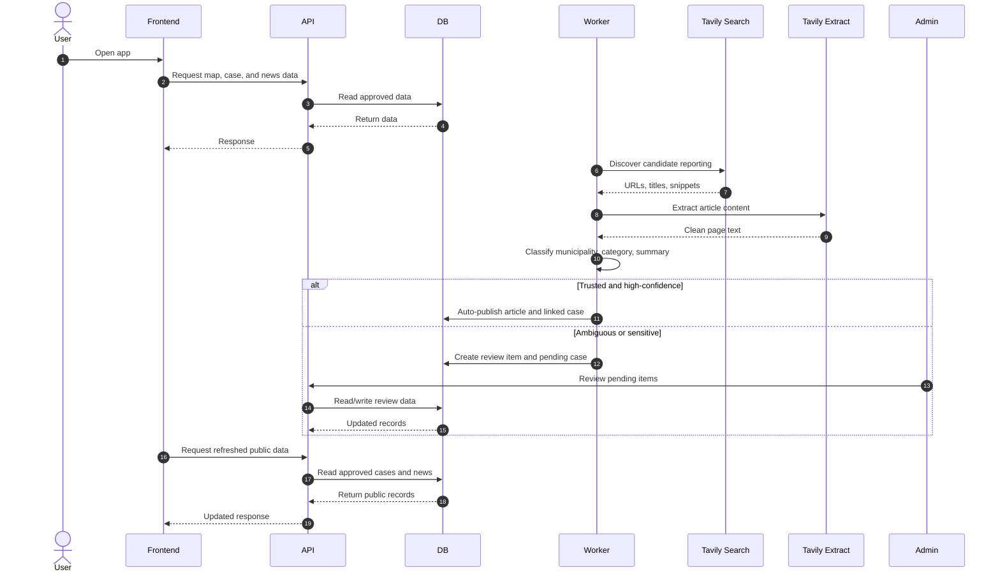

# System Overview

Coastal Watch is a civic intelligence platform that monitors coastal access and development in Puerto Rico.

## What this system does

The platform collects information from public sources, extracts structured data through an automated worker, auto-publishes trusted high-confidence items, and routes uncertain or sensitive information through human review before publishing it to users.

---

## System Flow

```mermaid
sequenceDiagram
    autonumber

    actor User
    participant Frontend
    participant API
    participant DB
    participant Worker
    participant TavilySearch as Tavily Search
    participant TavilyExtract as Tavily Extract
    participant Admin

    User->>Frontend: Open app
    Frontend->>API: Request map, case, and news data
    API->>DB: Read approved data
    DB-->>API: Return data
    API-->>Frontend: Response

    Worker->>TavilySearch: Discover candidate reporting
    TavilySearch-->>Worker: URLs, titles, snippets
    Worker->>TavilyExtract: Extract article content
    TavilyExtract-->>Worker: Clean page text
    Worker->>Worker: Classify municipality, category, summary
    alt Trusted and high-confidence
        Worker->>DB: Auto-publish article and linked case
    else Ambiguous or sensitive
        Worker->>DB: Create review item and pending case
        Admin->>API: Review pending items
        API->>DB: Read/write review data
        DB-->>API: Updated records
    end

    Frontend->>API: Request refreshed public data
    API->>DB: Read approved cases and news
    DB-->>API: Return public records
    API-->>Frontend: Updated response
```

---

## How the system works

1. User opens the app and requests map data
2. Frontend calls the API
3. API returns only approved cases from the database
4. Worker discovers candidate reporting from Tavily Search
5. Tavily Extract retrieves article content for queued URLs
6. The worker applies municipality/category extraction and summary heuristics
7. Trusted, high-confidence records auto-publish
8. Uncertain or sensitive records go to the review queue
9. Admin reviews and approves or rejects queued items
10. Approved cases and articles become public through the API

---

## Key Principles

- Source-backed data only
- Auto-publish only for trusted, high-confidence reporting
- Human review for uncertain or sensitive publication decisions
- Strict separation of public vs internal data
- Full auditability
